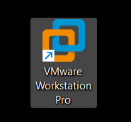
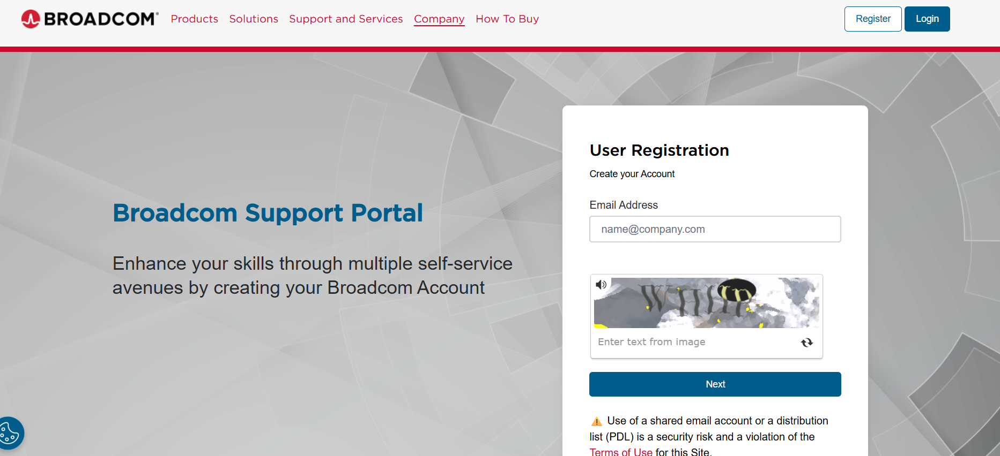
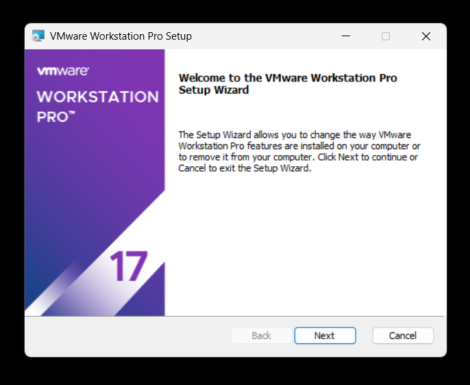

<h1>VMware Workstation - Prerequisites and Installation</h1>
This project provides a step-by-step guide for installing VMware Workstation Pro and preparing a Windows Server 2022 ISO for use in a virtualized lab environment. 

<h2>Video Demonstration</h2>

- ### [YouTube: How To Install osTicket with Prerequisites](https://www.youtube.com)

<h2>Environments and Technologies Used</h2>

- VMware Workstation Pro
- Windows Server 2022
- Windows 10/11 host

<h2>Documentation and Rescources</h2>

[VMware Workstation Pro Installation Guide](https://knowledge.broadcom.com/external/article?articleNumber=368667)

[Windows Server 2022 ISO](https://www.microsoft.com/en-us/evalcenter/download-windows-server-2022)

<h2>List of Prerequisites</h2>

- Host system requirements
- Minimum RAM and disk
- VMware account
- Windows Server 2022 ISO download

<h2>Installation Steps</h2>

  
### Create a VMware Account 

Open the VMware website [Broadcom portal](https://profile.broadcom.com/web/registration).

Create a profile / user account.

Log in to the portal.

### Download VMware Workstation

Choose VMware Workstation 17 for Personal Use

Download the installer for your system.

Go to download file on your computer click the download and click next until download starts

 

### Install VMware Workstation Pro
Locate the downloaded installer (.exe) in your Downloads folder.

Right-click → Run as Administrator

Accept the license terms.

Select Typical Installation.

Install enhanced keyboard driver (optional).

Complete installation.

Restart your computer if prompted.

 

Lorem ipsum dolor sit amet, consectetur adipiscing elit, sed do eiusmod tempor incididunt ut labore et dolore magna aliqua. Ut enim ad minim veniam, quis nostrud exercitation ullamco laboris nisi ut aliquip ex ea commodo consequat. Duis aute irure dolor in reprehenderit in voluptate velit esse cillum dolore eu fugiat nulla pariatur.

 
