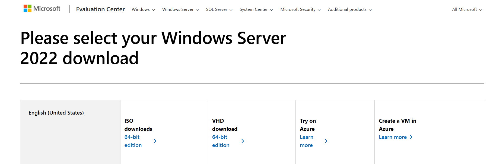

<h1>VMware Workstation - Prerequisites and Installation</h1>
This project covers the prerequisites for installing VMware Workstation Pro and preparing a Windows Server 2022 ISO for use in a virtualized lab environment.  
Completing these steps ensures your system is ready for virtualization labs and foundational IT exercises as part of the CourseCareers IT Certification program. 

<h2>Video Demonstration</h2>

- ### [YouTube: How To Install VMware Workstation](https://www.youtube.com)

<h2>Environments and Technologies Used</h2>

- VMware Workstation Pro
- Windows Server 2022
- Windows 10/11 host

<h2>Documentation and Rescources</h2>

[VMware Workstation Pro Installation Guide](https://knowledge.broadcom.com/external/article?articleNumber=368667)

[Windows Server 2022 ISO](https://www.microsoft.com/en-us/evalcenter/download-windows-server-2022)

<h2>List of Prerequisites</h2>

- Host system requirements
- Minimum RAM and disk
- VMware account
- Windows Server 2022 ISO download

<h2>Installation Steps</h2>

  
### Create a VMware Account 

Open the VMware website [Broadcom portal](https://profile.broadcom.com/web/registration).

Create a profile / user account.

Log in to the portal.

Choose VMware Workstation 17 for Personal Use

Download the installer for your system.

 

### Install VMware Workstation Pro

Locate the downloaded installer in your Downloads folder.

Right-click → Run as Administrator

Accept the license terms.

Select Typical Installation.

Install enhanced keyboard driver (optional).

Complete installation.

Restart your computer if prompted.

 

  
## Download the Server ISO

Visit the Microsoft Evaluation Center:
https://www.microsoft.com/en-us/evalcenter/download-windows-server-2022

Select Download the ISO.

Fill out the brief form (name, email, role).

Start the download.

Download time: 5–10 minutes (depending on internet speed)

You should now see the Windows Server 2022 ISO file in your Downloads folder.

## Next Steps

This README covers only the prerequisites for installing VMware Workstation Pro and preparing a Windows Server 2022 ISO.  
Future steps will be part of other lab projects, including:

- Installing VMware Workstation Pro on the host machine  
- Creating and configuring a Windows Server 2022 virtual machine  
- Installing Windows Server 2022 inside the VM  
- Post-installation configuration (VMware Tools, snapshots, network settings, roles/features)

These topics will be documented in separate project guides as the lab series progresses.

 
